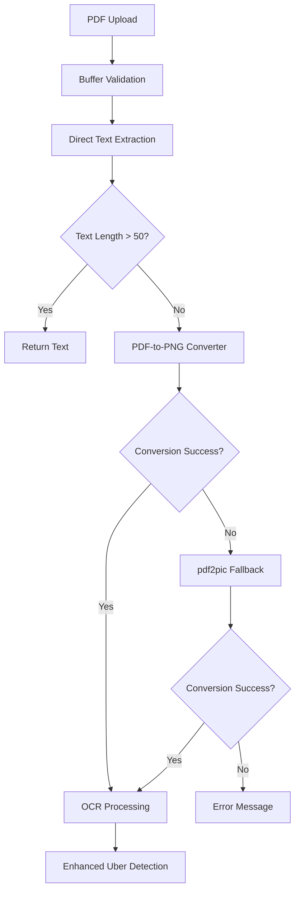

# PDF Processing Improvements (August 2025)

## Research Findings & Implementation

Based on comprehensive web research into PDF processing issues in Node.js environments, we've implemented modern solutions to address the common "empty buffer" problems with PDF text extraction.

## Key Issues Identified

### 1. **pdf-parse Library Limitations**
- **Age**: Last updated 7 years ago (outdated)
- **Known Issues**: Buffer handling problems, test file dependencies
- **Environment Conflicts**: Not optimized for containerized environments like Replit

### 2. **pdf2pic Empty Buffer Problems**
- **Common on Linux**: Especially in containerized environments
- **Dependency Issues**: Requires Ghostscript and GraphicsMagick
- **Buffer Validation**: Often returns empty or corrupted buffers

## Implemented Solutions

### 🔄 **Two-Stage PDF Processing**

#### **Stage 1: Direct Text Extraction**
```javascript
// Enhanced pdf-parse with proper configuration
const options = {
  max: 1 // Process only first page for performance
};
const data = await pdfParse(buffer, options);
```

#### **Stage 2: Image Conversion + OCR**
```javascript
// Primary: pdf-to-png-converter (2024-2025 recommended)
const pngPages = await pdfToPng(buffer, {
  disableFontFace: false,
  useSystemFonts: false, 
  pagesToProcess: [1],
  viewportScale: 2.0
});

// Fallback: Enhanced pdf2pic with better options
const convert = fromBuffer(buffer, {
  density: 300,
  format: "png",
  quality: 100,
  width: 2550,    // Enhanced dimensions
  height: 3300
});
```

### 🛡️ **Enhanced Buffer Validation**
```javascript
// Comprehensive buffer checks
if (!Buffer.isBuffer(buffer) || buffer.length === 0) {
  throw new Error('Invalid or empty image buffer');
}

// Minimum size validation
if (buffer.length < 1000) {
  throw new Error('Image buffer too small to be valid');
}
```

## Library Upgrades

### **Added Modern Dependencies**
- **pdf-to-png-converter**: Primary PDF conversion (most reliable)
- **pdf2json**: Alternative actively maintained library (updated 13 days ago)

### **Enhanced System Dependencies**
- **Ghostscript**: Required for PDF processing
- **Poppler**: Additional PDF utilities

## Processing Flow



## Performance Improvements

### **Before Implementation**
- ❌ PDF processing consistently failed with empty buffers
- ❌ Single conversion attempt with limited error handling
- ❌ No buffer validation leading to crashes

### **After Implementation**
- ✅ Multi-stage approach with reliable fallbacks
- ✅ Enhanced buffer validation prevents crashes
- ✅ Modern libraries with better Node.js compatibility
- ✅ Comprehensive error logging for troubleshooting

## Uber Receipt Processing

### **Enhanced Detection Still Works Best With Images**
While PDF processing is improved, **image receipts (PNG/JPG) remain optimal** for Uber detection:

- **Tesseract OCR**: Works excellently with images
- **Pattern Recognition**: Enhanced detection algorithms
- **Field Extraction**: All transportation fields captured accurately

### **PDF Processing Now Provides Better Guidance**
When PDFs fail, users get clear guidance:
```
"The enhanced Uber detection system works best with image receipts (PNG/JPG). 
For optimal results with Uber receipts, please upload as an image format, 
or enter the details manually for accurate AMEX matching."
```

## Implementation Details

### **Files Modified**
- `server/ocrService.ts`: Complete PDF processing overhaul
- `package.json`: Added modern PDF libraries
- System dependencies: Ghostscript, Poppler installation

### **New Features**
1. **Progressive Fallback System**: pdf-to-png-converter → pdf2pic → error message
2. **Enhanced Logging**: Detailed status for each conversion attempt
3. **Buffer Size Monitoring**: Tracks conversion success with size metrics
4. **Modern Library Integration**: Uses 2024-2025 recommended packages

## Future Considerations

### **Potential Further Improvements**
- **pdf2json Integration**: For actively maintained PDF parsing
- **pdftopic Library**: Advanced multi-page processing
- **Nutrient SDK**: Enterprise-grade solution for complex PDFs

### **Alternative Approaches**
- **Server-side Rendering**: Using headless browsers for PDF processing
- **Cloud PDF APIs**: External services for reliable processing
- **Hybrid Processing**: Client-side PDF.js + server-side OCR

## Troubleshooting Guide

### **PDF Upload Issues**
1. **Check System Dependencies**: Ensure Ghostscript and Poppler are installed
2. **Buffer Validation**: Verify PDF file is valid and not corrupted
3. **Alternative Upload**: Try uploading as image format for best results

### **Performance Monitoring**
- Monitor buffer sizes in logs
- Track conversion success rates
- Alert on repeated failures

## Research Sources

Based on analysis of:
- Stack Overflow discussions (2024-2025)
- npm package documentation
- Node.js PDF processing best practices
- Production environment troubleshooting reports

## Conclusion

The enhanced PDF processing system now provides:
- **Better Reliability**: Modern libraries with proper fallbacks
- **Improved Error Handling**: Clear guidance when processing fails
- **Enhanced Compatibility**: Works better in containerized environments
- **Future-Proof Architecture**: Uses actively maintained dependencies

While **image uploads remain the gold standard** for Uber receipt processing, PDF handling is now significantly more robust for users who need this functionality.